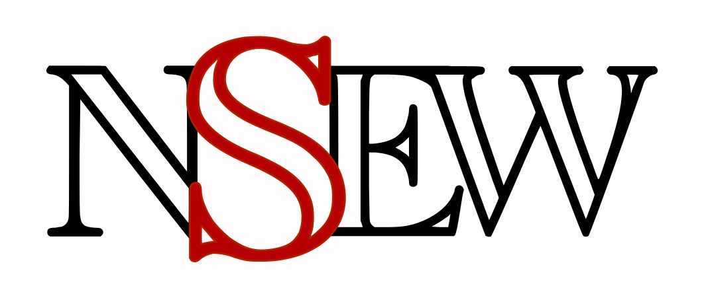

NSEW Virtual Keyboard
=====================



**NSEW** is a virtual keyboard designed for text insertion with the directional keys of a remote controller (_up_, _right_, _down_, _left_ and _enter_) or a numpad. The normal keyboard layout (a retangular box) is clumsy when used with this kind of device or in these specific conditions.

**NSEW** solves this situation minimizing the number of strokes needed to select a specific character, in accordance with the common letter frequency of the selected language (English is the default).

<p align="center">
  </a>
</p>

The user presses the directional keys until the desired character is under the cursor, then presses ENTER (or 5, in this demonstration). The chosen character is inserted in the field area and the cursor gets back to the central position (the _Mode_ key).

<!-- ## Getting Started

These instructions will get you a copy of the project up and running on your local machine for development and testing purposes. See deployment for notes on how to deploy the project on a live system. -->

<!-- ### Prerequisites

What things you need to install the software and how to install them

```
Give examples
```

### Installing

A step by step series of examples that tell you how to get a development env running

Say what the step will be

```
Give the example
```

And repeat

```
until finished
```

End with an example of getting some data out of the system or using it for a little demo -->

<!-- ## Running the tests

Explain how to run the automated tests for this system

### Break down into end to end tests

Explain what these tests test and why

```
Give an example
```

### And coding style tests

Explain what these tests test and why

```
Give an example
``` -->

## Deployment

NSEW is very simple to use. Simply add the *NSEW_container* ID to an empty *div*, and a *NSEW_input* class to an *input* element.

## Built With

* [JavaScript/ECMAScript](https://www.ecma-international.org/publications/standards/Ecma-262.htm)
* [QUnit](https://qunitjs.com/) - Testing framework

<!-- ## Contributing

Please read [CONTRIBUTING.md](https://gist.github.com/PurpleBooth/b24679402957c63ec426) for details on our code of conduct, and the process for submitting pull requests to us. -->

## Authors

* **Alexandre Paloschi Horta** - *Concept and Initial work* - [AlexPHorta](https://github.com/AlexPHorta)

See also the list of [contributors](https://github.com/AlexPHorta/nsew-keyboard/contributors) who participated in this project.

## Versioning

We use [SemVer](http://semver.org/) for versioning. For the versions available, see the [tags on this repository](https://github.com/AlexPHorta/nsew-keyboard/tags). 

## License

This project is licensed under the MIT License - see the [LICENSE](LICENSE) file for details

## Acknowledgments

* The JavaScript development team;
* Every virtual keyboard that sucks to be used;
* Thanks to my wife, Thays, and to my daughters, Bárbara and Lavínia.
