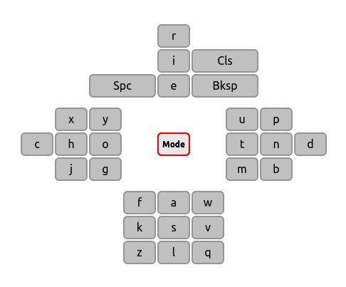

NSEW Virtual Keyboard
=====================

*NSEW* is a virtual keyboard designed for text insertion with the directional keys of a remote controller (_up_, _right_, _down_, _left_ and _enter_) or a numpad. The normal keyboard layout (a retangular box) is clumsy when used with this kind of device or in these specific conditions.

*NSEW* tries to solve this situation minimizing the number of strokes needed to select a specific character, in accordance with the common letter frequency of the English language (for now, other languages will be added soon).

The user presses the directional keys until the desired character is under the cursor, then presses ENTER (or 5, in this demonstration). The chosen character is inserted in the field area and the cursor gets back to the central position (the _Mode_ key).
